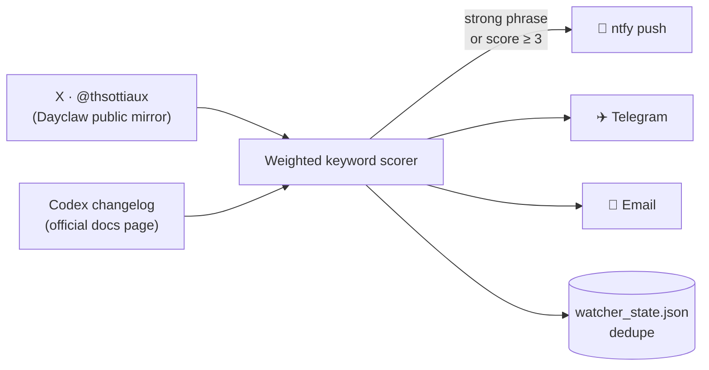

<div align="center">

# 🔄 tibo-watcher

> **此本地改造版：** GitHub Actions + AIHOT 公共公告源 + 个人微信 PushPlus / SMTP 邮件，包含持久补发。请先阅读 [中文部署说明](DEPLOY.zh-CN.md)。下面保留上游介绍供溯源；其中 Dayclaw、首轮状态及推送失败行为已被本版本替换。

**Your phone buzzes the moment Codex usage limits reset.**

[](https://www.python.org/)
[]()
[]()
[](LICENSE)

Watches [**@thsottiaux**](https://x.com/thsottiaux) — *Tibo*, the Codex lead at OpenAI —
plus the official [Codex changelog](https://learn.chatgpt.com/docs/changelog).
When either hints at **limits being reset, refreshed, credited, or changed**,
you get a push notification within minutes.

*No API keys. No accounts. No servers to pay for.*

</div>

---

## Why this exists

Codex weekly limits reset without warning. Tibo often tweets about it —
*"we'll credit every Codex account"*, *"limits now refresh daily"* — but unless
you're staring at X all day, you find out hours later. This tool does the
staring for you, so you can jump back into heavy usage (or burn leftover
quota) the moment the tank refills.

## Deploy it in 3 steps

**Works with a free GitHub account. One secret, no cloud config.**

1. **Fork or push this repo to GitHub.**
2. **Add one repository secret** — Settings → Secrets and variables → Actions →
   `New repository secret`:
   - Name: `NTFY_TOPIC` · Value: any unguessable string, e.g. `tibo-codex-k7m2qx`
3. **Subscribe on your phone** — install the free
   [ntfy](https://ntfy.sh/docs/subscribe/phone/) app (Android/iOS) and add that
   same topic name.

Done. The included GitHub Action now checks every 10 minutes, even with your
computer off. Tap *Actions → watch → Run workflow* to fire the first check
right now.

<details>
<summary><b>Prefer running it on your own machine?</b></summary>

```bash
git clone https://github.com/YOUR_USERNAME/tibo-watcher
cd tibo-watcher
python main.py --loop
```

Python 3.10+ — nothing to `pip install`. Windows Task Scheduler alternative:

```powershell
schtasks /create /tn "tibo-watcher" /tr "python C:\path\to\tibo-watcher\main.py" /sc minute /mo 10
```

</details>

## What an alert looks like

```
🔄 Codex limits watch: It's me again. I come bearing great news...

Possible Codex limits signal (score 6: usage-limits, credits, codex, chatgpt)
Source: X @thsottiaux | 2026-08-20
https://x.com/thsottiaux/status/2090766694897619318
---
It's me again. I come bearing great news. First of all, we have hit 20M
active users for Codex... during the day we will credit every Codex and...
```

Tapping the notification opens the original post.

## How it works



1. **Fetch** — two independent sources, each failure-isolated so one outage
   never kills a run.
2. **Score** — transparent weighted regex rules, no LLM calls:
   | Tier | Points | Examples |
   |---|---|---|
   | Strong | 3 | *"limits … reset"*, *"credits for all users"*, *"we've granted…"* |
   | Medium | 2 | "rate limits", "quota", "usage caps", "weekly cap", "credits" |
   | Weak | 1 | "codex", "chatgpt", "openai" |

   Explicit reset phrasing always alerts; milder limit talk must also mention
   the Codex/ChatGPT/OpenAI world and clear the threshold. *"I was gifted a
   reset button"* scores 0 — a reset needs a *limit* nearby.
3. **Dedupe** — seen items persist to `watcher_state.json` (written atomically,
   committed back by the Action). The first run baselines silently, so
   history never spams you.
4. **Push** — findings fan out to every configured channel, capped at 5 per
   cycle.

## Configuration

Everything is optional — copy `.env.example` to `.env` and tune:

| Variable | Default | What it does |
|---|---|---|
| `NTFY_TOPIC` | — | phone push topic (the one deploy step that matters) |
| `TIBO_HANDLE` | `thsottiaux` | who to watch on X |
| `WATCH_INTERVAL_MIN` | `10` | minutes between checks in `--loop` mode |
| `SCORE_THRESHOLD` | `3` | lower = noisier, higher = only slam dunks |
| `ALERT_ALL` | `0` | `1` pushes every new post regardless of score |
| `INCLUDE_REPLIES` | `1` | replies often carry the juiciest hints |
| `WATCH_CHANGELOG` | `1` | `0` disables the changelog source |
| `TELEGRAM_BOT_TOKEN` / `TELEGRAM_CHAT_ID` | — | optional Telegram delivery |
| `SMTP_*` / `MAIL_TO` | — | optional email delivery |

Channels stack — configure all three and every finding hits phone, Telegram,
and inbox together.

## Commands

```bash
python main.py                  # one check cycle (scheduler-friendly)
python main.py --loop           # forever, every 10 minutes
python main.py --test-notify    # verify your phone setup
python main.py --dry-run --verbose   # see every item + score, no side effects
python main.py --prime          # re-baseline after tuning rules
```

## Project structure

```
main.py                     entry point
watcher/
├── cli.py                  argument parsing
├── config.py               .env + environment handling
├── fetch.py                HTTP with retries (stdlib urllib)
├── sources.py              Dayclaw feed + changelog page parsers
├── detect.py               weighted keyword rules
├── state.py                dedupe store, atomic writes
├── notify.py               ntfy / Telegram / SMTP delivery
└── run.py                  check cycle + loop
.github/workflows/watch.yml every-10-minutes cloud schedule
```

## Notes & limits

- **Unofficial** fan tool — not affiliated with OpenAI. It reads public
  wording and guesses; expect occasional false positives or missed hints.
- X data comes from the free [Dayclaw](https://dayclaw.com) mirror because the
  official X API starts at ~$100/month. If the mirror briefly rate-limits,
  that cycle skips X, keeps watching the changelog, and retries next run.
- GitHub may delay busy schedules by a few minutes; for exact 10-minute
  timing run `--loop` locally.

## License

[MIT](LICENSE)
